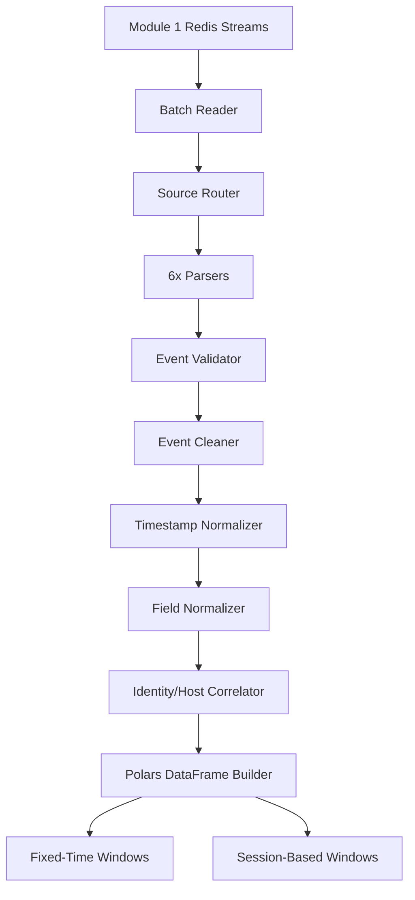

# Module 2 — Ingestion and Preprocessing
## Final Verification and Architecture Report

This document confirms the successful completion of **Module 2 — Ingestion and Preprocessing**. 
Module 2 is designed strictly to ingest, clean, normalize, correlate, and window events for downstream detection by NHI/LOTL modules. **It does not perform threat classification.**

---

### 1. Architecture

The pipeline orchestrates 11 discrete stages to reliably transform raw JSON payloads from Redis into grouped Polars DataFrames:

### 2. Input Streams
The pipeline successfully consumes exactly these 6 configured Redis streams:
- `telemetry:sysmon`
- `telemetry:auditd`
- `telemetry:ollama`
- `telemetry:iam`
- `telemetry:vault`
- `telemetry:api_gateway`

### 3. Parsing
Six source-specific parsers were implemented inheriting from `BaseParser`. They strictly convert the stringified JSON into structured Python dictionaries without normalizing keys (normalization happens downstream).

### 4. Validation
`EventValidator` enforces:
- Envelope integrity (`envelope_id`, `source_type`, `ingested_at`)
- `INVALID_EVENT_POLICY` (drop, quarantine, or raise).
- `DEDUPLICATION_POLICY` using a stateful hash set for `envelope_id`.
- Source-specific constraints (e.g., Sysmon must have an integer `EventID`).

### 5. Cleaning
`EventCleaner` implements recoverable cleaning logic:
- Recursively strips whitespace from all string fields.
- Converts empty strings (`""`) to `None`.
- **Raw payload preservation**: The original `raw_payload` string is explicitly untouched and persists securely inside the envelope.

### 6. Normalization
- **Timestamp**: `TimestampNormalizer` extracts the most accurate source-dependent timestamp (e.g., `UtcTime` for Sysmon, epoch for Auditd). It applies `TIMEZONE_POLICY` (default UTC) and `TIMESTAMP_FORMAT`. Falls back to `ingested_at`.
- **Field**: `FieldNormalizer` intelligently maps proprietary fields to a common schema (`event_id`, `timestamp`, `source_type`, `host`, `identity`, `event_type`, `action`, `process_name`, `process_path`, `parent_process`, `parent_pid`, `command_line`, `resource`, `source_ip`, `user_agent`, `model`, `prompt`, `response`, `success`, `latency_ms`). 

### 7. Correlation
`EventCorrelator` explicitly:
- Strips wrapper objects leaving the `common_event` schema.
- **Strictly sorts events chronologically** by parsing the normalized timestamp, mitigating out-of-order Redis arrival.
- Enriches events with a `correlation_key` (format: `host|identity`) and a `process_link` (format: `host|pid:parent_pid`) to prepare for DataFrame windowing.

### 8. Polars
`DataFrameBuilder` ingests the batched dictionaries and generates a strongly-typed `pl.DataFrame`, securely casting strings to `pl.Datetime`.

### 9. Fixed Windows
`FixedTimeWindowBuilder` uses Polars `group_by_dynamic()` to aggregate event sequences per `correlation_key` grouped by a configurable `TIME_WINDOW_SIZE` (default 300s/5m).

### 10. Session Windows
`SessionWindowBuilder` tracks stateful behavioral sessions. 
- Utilizes `SESSION_GAP_THRESHOLD` (default 1800s/30m).
- Safely maintains cross-batch state memory using the `correlation_key` to intelligently track continuous activity across repeated execution boundaries.

---

### 11. Test Data (STEP 0)
> [!WARNING]
> The data generated in `preprocessing/test_data/generate_test_events.py` is entirely **DEVELOPMENT/TEST DATA**. It mimics the Module 1 envelope exactly but generates synthetic events. It is NOT real telemetry and is used strictly for parallel Module 2 development.

### 12. End-to-End Results

The pipeline successfully executed against the synthetic multi-scenario Step 0 DEV batch:

| Metric | Result |
|---|---|
| **Events Read** | 35 |
| **Valid Events** | 30 |
| **Invalid Events Caught** | 5 |
| **Duplicates Dropped** | 1 |
| **DataFrame Rows** | 30 |
| **Fixed Windows** | 14 time buckets created |
| **Session Windows** | 11 continuous sessions identified |

*(Test scenarios correctly caught: Missing source_type, missing raw_payload, duplicate envelope_id, malformed JSON).*

### 13. Module Boundary
> [!IMPORTANT]
> Module 2 strictly prepares and windows evidence. **Module 2 does not decide whether an event is malicious.** It outputs structurally sound, chronologically ordered DataFrames for ingestion by the downstream LOTL/LOLLM and NHI models.

### 14. Module 1 Integration
Because Module 2's `RedisBatchReader` perfectly mimics the `envelope` schema agreed upon, moving to production requires exactly **zero code changes** to the preprocessing pipeline. 

To transition from dev to prod:
1. Stop running `generate_test_events.py`.
2. Ensure Module 1 is publishing to the exact same Redis instance.
3. The Module 2 pipeline will automatically read the real Module 1 data gracefully.
